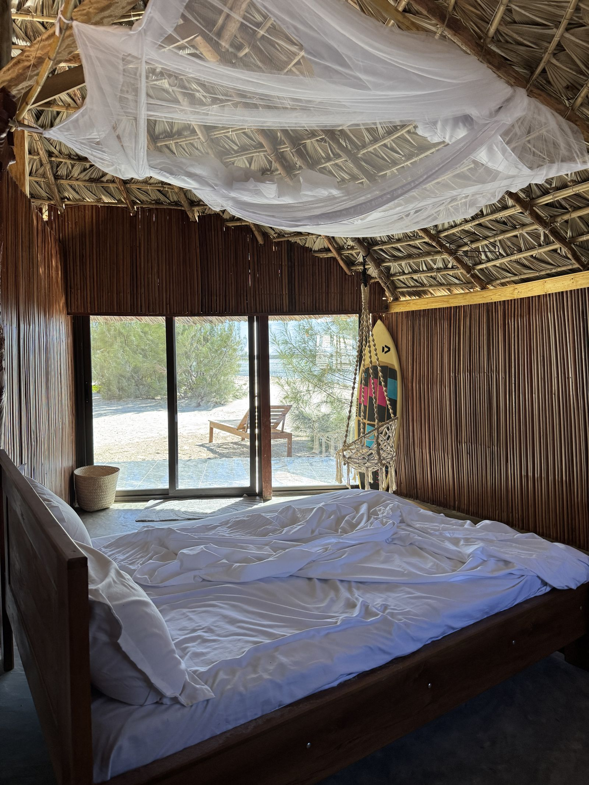

# Tsiky Lodge — Site web officiel

Site vitrine statique (HTML5 / CSS3 / JavaScript vanilla) pour Tsiky Lodge, lodge de charme de 5 unités à Baie Sakalava, Diego-Suarez, Nord de Madagascar. Aucun framework, aucun build, aucune dépendance npm : le site s'ouvre et fonctionne directement.

## 1. Lancer le site en local

Le site est 100% statique. Deux options :

**Option A — ouvrir directement le fichier**
Double-cliquez sur `index.html`, ou ouvrez-le depuis votre navigateur (`Fichier > Ouvrir`). Tout fonctionne (navigation, langue, galerie, formulaires) à l'exception de la carte OpenStreetMap intégrée, qui nécessite un vrai serveur pour certains navigateurs.

**Option B — via un petit serveur local (recommandé)**
Depuis le dossier du projet :

```bash
python3 -m http.server 5173
```

Puis ouvrez `http://localhost:5173` dans votre navigateur.

## 2. Où remplacer les photos

Toutes les images sont actuellement des **placeholders SVG** (fond sable + nom du fichier), listés en détail dans [`assets/img/README.md`](assets/img/README.md). Pour les remplacer :

1. Déposez vos photos définitives dans `assets/img/`, avec **exactement les mêmes noms de fichiers** que les placeholders (ex. `hero-baie-sakalava.jpg`, `bungalow-familial-01.jpg`…), en respectant les dimensions recommandées.
2. Dans le HTML, remplacez chaque `` par le fichier `.jpg` ou `.webp` correspondant. Pour une meilleure performance, utilisez une balise `<picture>` :

```html
<picture>
  <source srcset="assets/img/bungalow-familial-01.webp" type="image/webp">
  
</picture>
```

3. Compressez vos photos avant mise en ligne (TinyPNG, Squoosh) : viser < 200 Ko par photo en `.webp`.
4. Le logo (`assets/img/logo-tsiky-lodge.svg`) est une version simplifiée à personnaliser selon votre charte graphique définitive.

## 3. Où mettre le numéro WhatsApp et l'email

- **WhatsApp** : ouvrez [`js/main.js`](js/main.js) et modifiez la constante en haut du fichier :
  ```js
  const WHATSAPP_NUMBER = "261XXXXXXXXX"; // format international, sans "+" ni espaces
  ```
- **Téléphone affiché** : recherchez `+261XXXXXXXXX` dans `index.html`, `hebergements.html`, `kite.html`, `excursions.html` et `contact.html` (liens `tel:` et texte affiché) et remplacez par le vrai numéro.
- **Email** : recherchez `contact@tsikylodge.com` dans les mêmes fichiers et remplacez par l'adresse définitive.
- **Réseaux sociaux** : dans la section Contact et le footer, remplacez les liens `https://www.facebook.com/` et `https://www.instagram.com/` par les vraies pages du lodge.
- **Formulaire de contact** : le `<form>` de la section Contact pointe vers `action="https://formspree.io/f/REMPLACER-PAR-ID-FORMSPREE"`. Créez un compte sur [Formspree](https://formspree.io) (gratuit pour un usage basique), récupérez votre identifiant de formulaire et remplacez l'URL. Alternative simple sans service tiers : remplacez `action` par `mailto:contact@tsikylodge.com` (moins fiable, dépend du client mail du visiteur).

## 4. Comment brancher le vrai moteur de réservation

Toute la logique de réservation est isolée dans [`js/booking.js`](js/booking.js), abondamment commenté. En résumé :

1. Ouvrez `js/booking.js`.
2. Remplacez la constante en tête de fichier :
   ```js
   const BOOKING_ENGINE_URL = "https://REMPLACER-PAR-URL-MOTEUR"; // TODO client
   ```
   par l'URL réelle de votre moteur (Beds24, Cloudbeds, WuBook, Booking Engine…).
3. Adaptez si besoin l'objet `PARAM_MAP` (noms des paramètres d'URL : dates d'arrivée/départ, nombre d'adultes, identifiant de chambre) et `ROOM_ID_MAP` (correspondance entre nos identifiants internes `familial`, `double`, `twin`, `double-sea` et les identifiants attendus par votre moteur) selon la documentation de votre prestataire.
4. Aucune autre modification n'est nécessaire : tous les boutons « Réserver » du site (barre de réservation, fiches hébergement, excursions, barre mobile) utilisent déjà ce fichier.

## 5. Comment ajouter une traduction (ou une 3e langue)

Toutes les traductions vivent dans [`js/i18n.js`](js/i18n.js), dans l'objet `translations = { fr: {...}, en: {...} }`.

- **Modifier un texte existant** : cherchez la clé correspondante (ex. `"hero.subtitle"`) dans `fr` et `en`, et modifiez la valeur.
- **Ajouter un nouveau texte** : ajoutez la clé dans les deux langues, puis dans le HTML, posez l'attribut `data-i18n="votre.cle"` sur l'élément concerné (le script remplace automatiquement le contenu texte). Pour un attribut (`alt`, `title`, `placeholder`, `aria-label`, `content`…), utilisez `data-i18n-attr="attribut:votre.cle"` (plusieurs paires séparables par `;`).
- **Ajouter une 3e langue** (ex. allemand) : dupliquez le bloc `en: {...}` en `de: {...}` et traduisez toutes les valeurs, puis ajoutez un bouton `data-lang="de"` dans le sélecteur de langue du header et du menu mobile (desktop + mobile, sur chaque page HTML).

## 6. Déployer le site

**Netlify / Vercel** : glissez-déposez le dossier du projet dans l'interface de déploiement (ou connectez le dépôt Git). Aucune configuration de build n'est nécessaire — laissez la commande de build vide et le dossier de publication à la racine (`.`).

**Hébergement FTP classique (o2switch, etc.)** : uploadez l'intégralité du contenu du dossier (fichiers HTML, `css/`, `js/`, `assets/`, `sitemap.xml`, `robots.txt`) à la racine de votre espace web (ou dans le sous-dossier de votre domaine), via FileZilla ou le gestionnaire de fichiers de votre hébergeur.

Avant la mise en ligne définitive, pensez à :
- mettre à jour les URLs `https://www.tsikylodge.com/...` dans les balises `<link rel="canonical">`, Open Graph, `hreflang`, `sitemap.xml` et `robots.txt` avec le nom de domaine réel ;
- vérifier les coordonnées GPS approximatives utilisées pour la carte et les données structurées (`geo` dans le JSON-LD, `index.html`) et les ajuster avec les coordonnées exactes du lodge ;
- remplacer toutes les valeurs marquées `TODO client` dans le code (WhatsApp, téléphone, email, moteur de réservation, formulaire de contact).

## Structure du projet

```
tsiky-lodge/
├── index.html            Page d'accueil (one-page enrichi)
├── hebergements.html      Détail des 3 hébergements
├── kite.html              École de kitesurf Michel Kite
├── excursions.html        Excursions en mer + circuits 4x4
├── contact.html           Contact & réservation
├── css/
│   ├── reset.css          Reset minimal
│   ├── variables.css      Design tokens (couleurs, typo, espacements)
│   ├── main.css           Styles des composants et sections
│   └── responsive.css     Breakpoints mobile-first
├── js/
│   ├── i18n.js            Traductions FR/EN + application au DOM
│   ├── nav.js              Header transparent/compact, menu mobile
│   ├── scroll-reveal.js   Apparitions au scroll, compteurs, parallax
│   ├── gallery.js         Lightbox de la galerie photo
│   ├── booking.js         Redirection vers le moteur de réservation externe
│   └── main.js            Carrousels, onglets, accordéon FAQ, WhatsApp, curseur
├── assets/
│   ├── img/               Images (placeholders SVG + README dédié)
│   └── fonts/             (Polices Google Fonts chargées via CDN, dossier réservé à un usage local futur)
├── sitemap.xml
├── robots.txt
└── README.md
```
